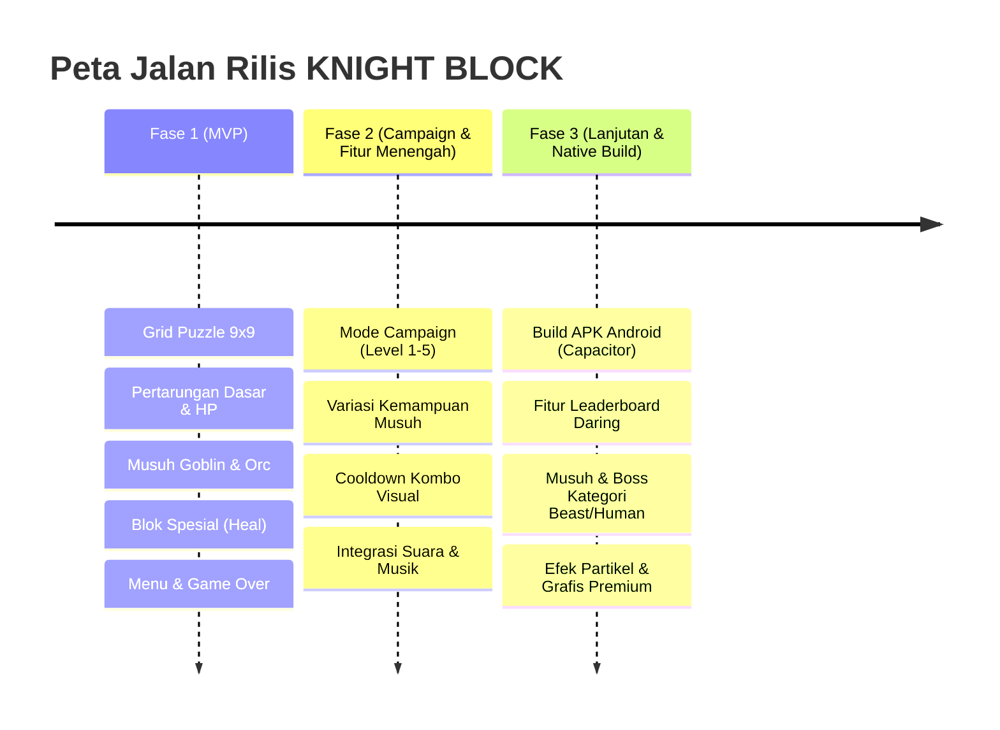

# Product Requirement Document (PRD): KNIGHT BLOCK

**Versi:** 1.0.0  
**Tanggal:** 11 Juni 2026  
**Status:** Draft / Siap Direview  
**Penulis:** Senior Product Manager  

---

## 1. Ringkasan Eksekutif (Executive Summary) & Tujuan Proyek (Objective)

### 1.1 Visi Produk
**KNIGHT BLOCK** adalah game puzzle penyusunan blok kasual yang menggabungkan mekanik adiktif *block puzzle* klasik dengan elemen pertarungan RPG fantasi. Berbeda dari game puzzle konvensional yang hanya berfokus pada perolehan skor tinggi, KNIGHT BLOCK memberikan tujuan yang lebih mendebarkan bagi pemain: **setiap baris atau kolom yang berhasil disusun dan dihancurkan akan diubah menjadi daya serang (damage) untuk mengalahkan musuh di layar**.

Pemain berperan sebagai ksatria ("You") yang bertarung melawan berbagai monster (Goblin, Orc, Skeleton, Werewolf, dll.) pada papan grid berukuran 9x9. Dengan mencocokkan blok secara taktis dan memanfaatkan rantai kombo, pemain harus terus bertahan hidup sembari menguras HP musuh sebelum waktu serangan musuh tiba.

### 1.2 Tujuan Proyek (Objectives)
*   **Menciptakan Core Loop yang Menarik:** Menggabungkan kepuasan mekanik *block clearing* dengan kepuasan mekanik RPG (mengurangi HP musuh, memicu item penyembuh, dan mengalahkan bos).
*   **Aksesibilitas Multiplatform:** Menyediakan pengalaman bermain game yang lancar dan responsif pada platform web seluler maupun desktop, serta mudah dipaketkan menjadi aplikasi Android native menggunakan Capacitor.

### 1.3 Metrik Kesuksesan (KPI/OKRs)
*   **Retention Rate (D1 & D7):** Menargetkan D1 Retention sebesar **35%** dan D7 Retention sebesar **12%** setelah rilis publik.
*   **Average Session Length:** Rata-rata durasi bermain berkisar antara **8 hingga 12 menit** per sesi, yang merupakan durasi ideal untuk game kasual seluler.
*   **Kills per Session:** Rata-rata jumlah musuh yang dikalahkan mencapai minimal **5 musuh** per sesi permainan (mode Endless).
*   **Performance Stability:** Game harus berjalan stabil di **60 FPS** pada minimal 95% perangkat Android kelas menengah ke bawah (*low-to-mid range devices*).
*   **Web Load Time:** Kecepatan pemuatan awal (*initial load time*) halaman web di bawah **3 detik** pada koneksi 4G standar.

---

## 2. Profil Pengguna (User Personas & User Journey)

### 2.1 User Personas

#### Persona 1: "Casual Gamer" (Budi, 24 Tahun)
*   **Demografis:** Mahasiswa, aktif menggunakan smartphone Android kelas menengah.
*   **Perilaku:** Bermain game di sela-sela waktu luang (menunggu bus, istirahat kuliah). Menyukai game yang cepat dibuka, mudah dimengerti, tetapi menantang untuk dikuasai.
*   **Kebutuhan:** Game yang tidak memerlukan komitmen waktu panjang, kontrol intuitif (cukup satu tangan/sentuhan), dan visual yang memuaskan saat berhasil menghancurkan blok.
*   **Kendala:** Cepat bosan jika game terlalu pasif atau hanya sekadar menyusun balok tanpa tujuan akhir yang jelas.

#### Persona 2: "Strategy Puzzle Enthusiast" (Siti, 29 Tahun)
*   **Demografis:** Pekerja kantoran, sering bermain di laptop maupun smartphone.
*   **Perilaku:** Penggemar berat game sejenis Tetris, Block Blast, atau Puzzle Quest. Suka menganalisis penempatan blok untuk memaksimalkan skor dan kombo.
*   **Kebutuhan:** Mekanik *damage scaling* yang jelas, variasi musuh dengan kemampuan unik yang menuntut adaptasi taktik, dan tantangan tingkat kesulitan yang bertahap.
*   **Kendala:** Merasa frustrasi jika penempatan blok terasa tidak adil (*randomness* terlalu tinggi) atau jika kontrol drag-and-drop tidak akurat (tidak presisi).

### 2.2 User Journey Map
1.  **Menu Utama:** Pemain masuk ke aplikasi dan langsung disajikan menu minimalis yang elegan. Pemain dapat memilih antara mode **Play Endless**, **Campaign**, atau mengakses **Options**.
2.  **Mulai Permainan (Game Start):** Papan grid 9x9 kosong ditampilkan bersama kartu HP Pemain (kiri) dan kartu HP Musuh pertama (kanan). Di bagian bawah layar, terdapat area *Tray* yang menampung 3 potongan blok acak.
3.  **Core Gameplay:**
    *   Pemain menahan (*press*) salah satu blok dari *Tray*, menyeretnya (*drag*), lalu melepaskannya (*drop*) pada posisi sel grid yang kosong.
    *   Jika berhasil membentuk baris horizontal atau kolom vertikal yang penuh (9 sel), baris/kolom tersebut akan hancur dengan efek visual *flash*.
    *   Penghancuran blok menghasilkan damage ke musuh saat itu juga berdasarkan jumlah baris yang dibersihkan secara bersamaan dan jumlah kombo yang aktif.
    *   Jika pemain membersihkan blok khusus (seperti *Health Block* berwarna hijau), pemain mendapatkan pemulihan HP.
4.  **Tantangan & Tekanan Waktu:** Setiap beberapa detik (misalnya, setiap 10-20 detik sesuai jenis musuh), musuh akan melancarkan serangan berkala yang langsung mengurangi HP ksatria.
5.  **Monster Defeated:** Ketika HP musuh mencapai 0, musuh tersebut kalah. Dalam mode Endless, musuh berikutnya yang lebih kuat akan muncul setelah transisi visual singkat.
6.  **Game Over:** Jika grid penuh dan pemain tidak bisa menempatkan satu pun dari blok yang tersisa di *Tray*, permainan berakhir. Skor pembunuhan (*Kills*) ditampilkan, dan pemain diberi opsi untuk *Restart* atau kembali ke *Menu*.

---

## 3. Persyaratan Fungsional (Functional Requirements)

Masing-masing modul utama KNIGHT BLOCK dipecah ke dalam User Stories beserta Acceptance Criteria (AC).

### 3.1 Modul 1: Endless Gameplay (Pertarungan Tanpa Batas)
*   **User Story:** 
    Sebagai pemain, saya ingin bertarung melawan musuh yang datang silih berganti secara terus-menerus dengan tingkat kesulitan yang meningkat, sehingga saya dapat menguji batas kemampuan bertahan hidup dan mencetak rekor eliminasi monster tertinggi.
*   **Acceptance Criteria (AC):**
    1.  Saat game dimulai dalam mode Endless, musuh pertama (default: Goblin) akan muncul dengan HP penuh.
    2.  Pemain dan musuh memiliki indikator visual berupa bar kesehatan (HP bar) dan teks angka HP yang diperbarui secara *real-time*.
    3.  Ketika HP musuh mencapai 0, status musuh dinyatakan kalah, jumlah "Kills" bertambah 1, dan permainan akan memicu animasi transisi bertuliskan *"Enemy Approaching"*.
    4.  Musuh baru dengan tipe berikutnya (diambil dari daftar entitas di `entities.js`) akan otomatis di-*spawn* setelah jeda transisi selesai (2 detik).
    5.  Serangan berkala musuh yang aktif akan dinonaktifkan sementara selama transisi pemanggilan musuh baru dan diaktifkan kembali setelah musuh baru muncul di arena.

### 3.2 Modul 2: Block Destroy Mechanism (Sistem Penghancuran Blok)
*   **User Story:** 
    Sebagai pemain, saya ingin menyeret blok dari baki bawah dan menaruhnya di grid 9x9 untuk memenuhi baris atau kolom, sehingga blok tersebut hancur dan menghasilkan damage bagi musuh.
*   **Acceptance Criteria (AC):**
    1.  Grid permainan berukuran tetap 9x9 sel, dengan area *Tray* di bagian bawah yang menampung tepat 3 potongan blok (*pieces*).
    2.  Pemain dapat menyentuh/klik blok di *Tray* dan menyeretnya ke grid dengan posisi blok melayang sedikit di atas posisi jari/kursor agar tidak tertutup.
    3.  Saat blok diseret di atas grid, sistem harus menampilkan proyeksi bayangan (*ghost preview*) yang menunjukkan posisi sel mana yang akan ditempati jika dilepas.
    4.  Jika blok dilepas di sel grid kosong yang valid, blok tersebut akan tertanam secara permanen dengan warna asalnya, dan slot di *Tray* ditandai sebagai kosong (*used*).
    5.  Jika blok dilepas di luar grid atau pada posisi yang tidak muat, blok harus kembali ke *Tray* tanpa penalti.
    6.  Ketika semua 3 blok di *Tray* telah digunakan, sistem harus mengisi ulang (*refill*) *Tray* dengan 3 blok acak baru secara instan setelah penempatan terakhir selesai.
    7.  Pembersihan baris horizontal atau kolom vertikal penuh (9 sel terisi) harus dipicu secara instan setelah blok dilepas, ditandai dengan animasi *flash* warna sebelum sel dikosongkan kembali.

### 3.3 Modul 3: Detection System (Deteksi Papan dan Logika Permainan)
*   **User Story:** 
    Sebagai sistem game, saya ingin mendeteksi kondisi grid secara akurat (penempatan valid, baris penuh, kombo beruntun, dan kekalahan), sehingga alur permainan berjalan adil dan konsisten sesuai aturan.
*   **Acceptance Criteria (AC):**
    1.  Sistem harus melarang penempatan blok jika sebagian sel blok menimpa sel grid yang sudah terisi atau berada di luar batas grid 9x9.
    2.  Sistem harus mendeteksi secara bersamaan jika ada beberapa baris dan kolom yang penuh dalam satu gerakan (*multi-line clear*) untuk dihitung sebagai bonus kerusakan.
    3.  **Sistem Kombo:** Jika pemain berhasil menghancurkan baris/kolom secara berturut-turut dalam kurun waktu 10 detik (10.000 ms) dari pembersihan sebelumnya, pengali kombo bertambah (+1 combo). Indikator durasi kombo harus ditampilkan secara visual berupa *cooldown bar*.
    4.  **Sistem Kekalahan (Game Over):** Setiap kali blok baru muncul di *Tray* atau setelah aksi penempatan selesai, sistem harus menganalisis apakah masih ada minimal satu sel kosong di grid yang dapat memuat salah satu blok aktif yang ada di *Tray*. Jika tidak ada penempatan yang valid sama sekali, game harus masuk ke kondisi Game Over.

### 3.4 Modul 4: Enemy Damage & Attack Timer (Serangan Musuh Berkala)
*   **User Story:** 
    Sebagai musuh, saya ingin menyerang ksatria pemain secara otomatis pada interval waktu tertentu, sehingga ksatria tersebut kehilangan HP dan memberikan elemen urgensi serta tekanan waktu bagi pemain.
*   **Acceptance Criteria (AC):**
    1.  Setiap musuh memiliki properti *attack interval* (dalam milidetik) dan jangkauan kerusakan (*damageMin* - *damageMax*).
    2.  Sebuah pengatur waktu (*attack timer*) harus berjalan terus selama permainan berlangsung (kecuali saat game dijeda).
    3.  Ketika timer mencapai batas intervalnya, musuh akan memicu animasi serangan (contoh: kilatan warna merah pada kartu HP pemain) dan mengurangi HP ksatria sejumlah nilai acak di antara jangkauan kerusakannya.
    4.  Kerusakan yang diterima pemain harus ditampilkan sebagai teks melayang merah di dekat indikator HP pemain.
    5.  Jika HP ksatria pemain berkurang hingga 0 atau kurang, status pemain dinyatakan kalah dan sistem memicu layar Game Over.

### 3.5 Modul 5: Powerup & Special Block (Mekanik Blok Pemulihan)
*   **User Story:** 
    Sebagai pemain, saya ingin sesekali mendapatkan blok khusus penyembuh di baki saya, sehingga saat saya menghancurkannya, saya dapat memulihkan HP ksatria saya dan bertahan lebih lama.
*   **Acceptance Criteria (AC):**
    1.  Setiap blok baru yang dibuat di *Tray* memiliki peluang sebesar **15%** untuk menjadi *Special Health Block*.
    2.  *Health Block* didefinisikan secara visual dengan warna hijau emerald terang (0x22c55e) dan memiliki simbol tanda tambah putih ("+") di tengah-tengah selnya.
    3.  Ketika baris atau kolom yang memuat *Health Block* tersebut berhasil dibersihkan, ksatria pemain menerima pemulihan kesehatan sebesar **5 HP** per sel khusus.
    4.  Sistem memancarkan partikel hijau/putih dari posisi sel yang hancur ke arah HP bar pemain sebagai indikasi visual proses penyembuhan (*healing*).

### 3.6 Modul 6: Sistem Menu & UI (Interface Navigasi)
*   **User Story:** 
    Sebagai pemain, saya ingin dapat mengakses menu utama, menjeda permainan untuk beristirahat, mengatur opsi, dan memulai ulang game dengan mudah, sehingga pengalaman navigasi saya terasa mulus.
*   **Acceptance Criteria (AC):**
    1.  **Menu Utama (MenuScene):** Menyediakan tombol yang jelas untuk "Play Endless", "Campaign", "Options", dan "Exit".
    2.  **Jeda Game (Pause Menu):** Selama pertempuran berlangsung, pemain dapat menekan tombol gir/settings di pojok atas untuk menjeda game. Menu jeda harus menutupi grid secara visual dengan overlay semi-transparan dan menghentikan seluruh timer serangan musuh.
    3.  **Layar Game Over:** Menampilkan status akhir permainan (Menang/Kalah), jumlah eliminasi monster (*Kills*), serta tombol "Play Again" untuk memulai ulang dan "Main Menu" untuk kembali ke beranda.
    4.  **Options Scene:** Menyediakan kontrol dasar untuk mengaktifkan/menonaktifkan efek suara (SFX) atau musik latar belakang.

---

## 4. Persyaratan Non-Fungsional (Non-Functional Requirements)

### 4.1 Keamanan (Security)
*   **Local State Validation:** Validasi skor, status eliminasi musuh, dan sisa HP harus dikelola seluruhnya di dalam variabel memori state Phaser secara terenkapsulasi untuk mencegah manipulasi nilai melalui inspeksi DOM browser sederhana.
*   **Secure API (Jika Terintegrasi Online):** Jika di masa mendatang skor diunggah ke *Leaderboard* daring, transmisi data wajib menggunakan protokol HTTPS dengan tanda tangan token digital (JWT/HMAC) untuk memverifikasi keabsahan data permainan.

### 4.2 Performa (Performance)
*   **Target Frame Rate:** Game harus mempertahankan performa minimal **60 FPS** selama fase gameplay intensif (misal: saat animasi ledakan blok dan partikel menyembur bersamaan).
*   **Memory Management:** Melakukan pembersihan objek grafik (*graphics cleanup*) dan pelepasan aset Phaser secara disiplin setiap kali scene berpindah atau di-*restart* guna mencegah kebocoran memori (*memory leaks*), terutama di browser mobile.
*   **Bundle Size:** Ukuran build final aplikasi web (HTML, CSS, JS, dan Aset Gambar/Suara) tidak boleh melebihi **8 MB** sebelum kompresi untuk meminimalkan beban kuota internet pemain.

### 4.3 Skalabilitas (Scalability)
*   **Modular Architecture:** Pengkodean entitas musuh (`entities.js`), konfigurasi tingkat kesulitan (`constants.js`), dan level kampanye (`campaign.js`) harus terpisah dari scene utama permainan. Hal ini memungkinkan penambahan konten baru hanya dengan memperbarui konfigurasi data, tanpa mengubah logika inti game di `GameScene.js`.
*   **Extensible Skills:** Sistem kemampuan musuh harus dirancang menggunakan pola strategi (*strategy pattern*) sehingga kemampuan baru (seperti meluncurkan racun atau membekukan blok) dapat didaftarkan dengan mudah.

### 4.4 Responsivitas Desain (Design Responsiveness)
*   **Scale Mode FIT:** Menggunakan konfigurasi `scale.mode: Phaser.Scale.FIT` dengan rasio aspek portrait standar 9:16 (resolusi referensi: 1080x1920).
*   **Auto Centering:** Canvas game harus secara otomatis memposisikan dirinya di tengah-tengah layar browser (`autoCenter: Phaser.Scale.CENTER_BOTH`) terlepas dari apakah pemain mengaksesnya melalui ponsel layar lebar, tablet, maupun layar desktop lebar dengan latar hitam/gelap di area luar canvas.
*   **Touch Friendly Hitbox:** Tombol-tombol navigasi harus memiliki batas sentuh (*hitbox*) minimal sebesar **48px x 48px** untuk menjamin kenyamanan sentuhan jari pada layar ponsel yang kecil.

---

## 5. Ruang Lingkup Rilis (Release Scope & Phases)

Pengembangan proyek KNIGHT BLOCK dibagi menjadi tiga fase rilis terstruktur untuk memastikan kualitas produk terjaga dengan baik.

### 5.1 Fase 1: MVP (Minimum Viable Product)
Fokus pada kestabilan mekanik bermain utama (*core gameplayloop*).
*   **Gameplay Grid:** Papan grid 9x9, drag-and-drop blok, proyeksi bayangan (*ghost*), pembersihan baris/kolom penuh, serta pengisian ulang baki dengan 3 blok baru.
*   **Pertarungan Dasar:** Pemain memiliki HP, musuh memiliki HP, damage dikirim ke musuh setiap kali baris hancur.
*   **Siklus Musuh:** Spawn musuh Goblin dan Orc, serangan otomatis musuh berdasarkan timer sederhana.
*   **Blok Spesial:** Hadirnya *Health Block* (peluang 15%) untuk memulihkan HP pemain.
*   **UI Esensial:** Menu Utama sederhana, tombol Pause di game, dan layar Game Over beserta penghitung jumlah pembunuhan (*Kills*).

### 5.2 Fase 2: Campaign & Fitur Menengah (Rilis Saat Ini)
Fokus pada retensi pemain dan kedalaman konten permainan.
*   **Mode Campaign:** Menyediakan 5 level kampanye terstruktur dengan musuh yang bertingkat dari *Forest Entrance* hingga *Goblin King*.
*   **Mekanik Kemampuan Musuh:** Musuh memiliki aksi khusus (seperti Goblin mengunci blok, Undead memberikan racun, Werewolf mengubah wujud).
*   **Peningkatan UI/UX:** Penambahan indikator durasi kombo visual berbentuk bar pengisian, dan transisi layar *Enemy Approaching* yang epik.
*   **Audio & SFX:** Integrasi musik latar fantasi (*background music*) dan efek suara saat menaruh blok, menghancurkan baris, serta suara sabetan pedang saat menyerang musuh.

### 5.3 Fase 3: Fitur Lanjutan & Native Mobile Build
Fokus pada komersialisasi dan penyebaran multiplatform.
*   **Mobile Native Build:** Optimalisasi Capacitor untuk menghasilkan file biner Android (APK/AAB) berkualitas tinggi dan bebas kendala performa.
*   **Leaderboard Online:** Integrasi sistem papan skor global agar pemain dapat bersaing mengumpulkan poin Endless tertinggi secara global.
*   **Dukungan Multi-bahasa:** Menyediakan opsi bahasa (Indonesia & Inggris).
*   **Polishing Grafis:** Menambahkan animasi partikel hancur berpartikel neon, getaran layar saat damage besar (*screen shake*), dan ilustrasi latar belakang pertempuran yang dinamis sesuai level.

---

## 6. Asumsi dan Dependensi (Assumptions & Dependencies)

### 6.1 Asumsi Proyek
1.  **Kemampuan Browser:** Browser target pemain (baik mobile Chrome/Safari maupun desktop) telah mendukung akselerasi perangkat keras HTML5 Canvas dan WebGL demi kenyamanan bermain di 60 FPS.
2.  **Metode Input:** Pemain menggunakan layar sentuh pada ponsel pintar atau kursor mouse pada perangkat desktop untuk melakukan drag-and-drop secara lancar tanpa adanya input sekunder (keyboard/gamepad).
3.  **Penyimpanan Lokal (Local Storage):** Penyimpanan progress level campaign serta pengaturan efek suara akan disimpan di penyimpanan lokal browser (*localStorage*) sebelum integrasi database daring diaktifkan di masa mendatang.

### 6.2 Dependensi Teknologi (Tech Stack Dependencies)
1.  **Phaser Engine (v3.x / v4.0.0-beta):** Pustaka inti (*framework*) pengembangan game berbasis HTML5. Semua struktur scene dan objek grafik bergantung penuh pada stabilitas API Phaser.
2.  **Vite Bundler (v5.x):** Sebagai alat bantu *build* dan *hot-reloading* server lokal yang mempercepat siklus pengkodean tim pengembang.
3.  **Capacitor CLI & Core (v6.x):** Sebagai jembatan untuk mengekspor proyek web game ini ke dalam bentuk kode sumber proyek Android Studio native.
4.  **Node.js & NPM:** Diperlukan untuk instalasi paket pustaka dan manajemen skrip eksekusi build proyek.
