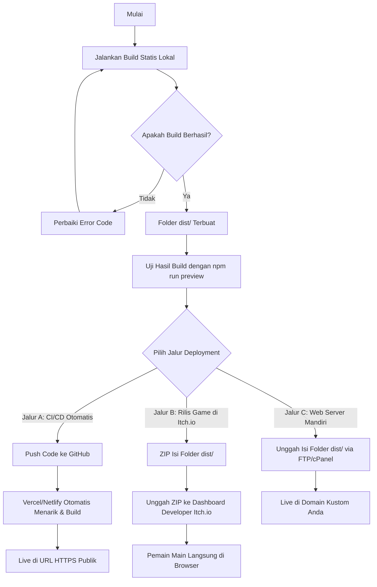

# Rencana Implementasi Teknis (Implementation Plan) — KNIGHT BLOCK

Dokumen ini memetakan persyaratan produk (PRD) KNIGHT BLOCK ke dalam arsitektur teknis kode sumber saat ini (*Phaser 3/4 + Vite + Capacitor*). Rencana ini telah diperbarui berdasarkan masukan dan keputusan dari sesi review sebelumnya, termasuk detail alur kerja (flow) lengkap untuk deployment web.

---

## 1. Deskripsi Tujuan & Kondisi Kode Saat Ini

Tujuannya adalah mengintegrasikan seluruh fitur inti yang didefinisikan dalam PRD ke dalam struktur kode sumber yang sudah berjalan. Berdasarkan analisis kode saat ini, sebagian besar mekanik inti permainan telah terimplementasi dengan sangat baik:
*   **Grid & Block Clearing:** Algoritma 9x9, drag-and-drop, deteksi baris/kolom penuh, serta *Special Health Block* (emerald) sudah selesai di `GameScene.js` dan `helpers.js`.
*   **Combat Loop (Endless):** Pertarungan tanpa batas melawan musuh secara sekuensial beserta sistem kombo telah berjalan.
*   **UI & Options:** Menu navigasi utama (`MenuScene.js`), pengaturan volume/suara (`OptionsScene.js`), dan pause overlay telah tersedia.

### Kesenjangan Teknis (Gaps) yang Diidentifikasi & Keputusan Solusi:
1.  **Fungsionalitas Campaign Mode:** Adegan `CampaignScene.js` saat ini hanya berupa layar pemuatan (*loading screen*) statis dan langsung memicu level index 0.
    *   *Keputusan:* Membuat antarmuka pemilihan level (*Level Selector*) untuk 5 level di `CampaignScene.js` dengan data dari `campaign.js`. Status progres level dikunci/terbuka berdasarkan data di `localStorage`.
2.  **Transisi Kemenangan Level Campaign:** Di `GameScene.js`, musuh dipanggil berurutan tanpa batas (*endless looping*).
    *   *Keputusan:* Saat ksatria mengalahkan musuh di level kampanye, game memicu status "Level Complete", menyimpan progres ke `localStorage`, dan memberi opsi berurutan ("Main Level Berikutnya") atau kembali ke menu pemilihan level.
3.  **Abilitas Unik Musuh:** Konfigurasi kemampuan khusus (seperti Goblin mengunci blok, Undead meracuni blok, Werewolf berganti wujud) belum diimplementasikan di `GameScene.js`.
    *   *Keputusan:* Ditunda dan dijadwalkan masuk di **Fase 2** agar peluncuran MVP stabil.
4.  **Umpan Balik Haptic/Getaran:**
    *   *Keputusan:* Menambahkan umpan balik getaran (*Vibration/Haptic Feedback*) menggunakan Capacitor Haptics Plugin saat ksatria pemain menerima damage dari serangan musuh.

---

## 2. Fitur yang Disepakati & Disetujui

> [!NOTE]
> **1. Alur Transisi Kampanye:**
> Pemain akan bermain secara **berurutan** (setelah menang Level 1, ditawari tombol langsung lanjut ke Level 2), namun pemain **tetap memiliki akses ke menu Level Selector** di `CampaignScene.js` untuk memilih ulang level yang telah diselesaikan.

> [!NOTE]
> **2. Penyimpanan Progress Lokal:**
> Semua data progres kelulusan level disimpan murni menggunakan `localStorage` peramban lokal dengan kunci kunci `knightblock_campaign_progress`.

> [!IMPORTANT]
> **3. Penambahan Efek Getaran (Haptics):**
> Kita akan menambahkan dependensi `@capacitor/haptics` ke proyek dan memicu getaran jangka pendek (*vibrate*) setiap kali ksatria terkena serangan monster.

---

## 3. Rencana Perubahan Kode (Proposed Changes)

Berikut adalah pembagian tugas modifikasi kode per komponen berdasarkan urutan prioritas:

### 3.1 Dependencies & Konfigurasi

#### [MODIFY] [package.json](file:///c:/ITTP/TUGAS/SEMESTER%206/Peminatan/block-blast-rpg/package.json)
*   Menambahkan dependensi `@capacitor/haptics` untuk mendukung getaran native pada perangkat Android.
    ```json
    "@capacitor/haptics": "^6.0.0"
    ```

#### [MODIFY] [entities.js](file:///c:/ITTP/TUGAS/SEMESTER%206/Peminatan/block-blast-rpg/src/config/entities.js)
*   Menyeimbangkan nilai awal HP pemain di `PLAYER_STATS`. Nilai maxHP diubah dari 100.000 menjadi **150 HP** atau **200 HP** agar sejalan dengan serangan musuh (8-16 HP) dan pemulihan *Health Block* (+5 HP).

---

### 3.2 Komponen Adegan Kampanye (Campaign Scene)

#### [MODIFY] [CampaignScene.js](file:///c:/ITTP/TUGAS/SEMESTER%206/Peminatan/block-blast-rpg/src/scenes/CampaignScene.js)
*   Mengubah visual scene dari sekadar *loading screen* menjadi antarmuka pemilihan level (Level 1 s.d. Level 5).
*   Membaca data dari `CAMPAIGN_LEVELS` di `campaign.js`.
*   Membaca status progres pemain dari `localStorage` (key: `knightblock_campaign_progress`, menyimpan indeks level tertinggi yang berhasil dibuka, contoh default: `1` untuk level 1 terbuka).
*   Menampilkan tombol-tombol level secara visual. Tombol level yang belum terbuka akan digambar dalam kondisi terkunci (*locked*) dan tidak dapat ditekan.
*   Saat tombol level diklik, scene akan memicu transisi ke `GameScene` dengan membawa parameter `mode: "campaign"`, `level: levelIndex`, dan `levelData: levelData`.
*   Menyediakan tombol "← Back" untuk kembali ke `MenuScene`.

---

### 3.3 Komponen Gameplay Utama (Game Scene)

#### [MODIFY] [GameScene.js](file:///c:/ITTP%20TUGAS%20SEMESTER%206/Peminatan/block-blast-rpg/src/scenes/GameScene.js)
*   **Logika Kondisi Akhir Kampanye:**
    *   Ubah fungsi `_onEnemyDefeated()`. Tambahkan pengecekan `if (this.mode === 'campaign')`.
    *   Jika mode kampanye aktif dan musuh mati, hentikan serangan musuh, ubah status permainan menjadi terjeda, lalu panggil `_endGame(true, "Level Selesai!")` untuk menampilkan status kemenangan level.
    *   Sebelum menampilkan layar kemenangan, simpan progres kelulusan ke `localStorage`. Jika level yang diselesaikan adalah `L`, maka set level terbuka selanjutnya `L + 1` ke dalam `localStorage`.
*   **Pembaruan Tombol Akhir Game (`_endGame`):**
    *   Pada fungsi `_endGame()`, jika pemain menang dalam mode kampanye:
        *   Tampilkan tombol **"🎮 Next Level"** jika masih ada level berikutnya dalam `CAMPAIGN_LEVELS`. Tombol ini langsung memicu restart `GameScene` dengan parameter level baru.
        *   Tampilkan tombol **"🗺️ Campaign Map"** yang mengarahkan pemain kembali ke `CampaignScene`.
*   **Integrasi Getaran Haptic:**
    *   Di dalam fungsi `_enemyAttack()` setelah ksatria menerima damage:
        *   Picu efek getaran menggunakan `@capacitor/haptics` dengan memanggil `Haptics.vibrate({ duration: 200 })` jika berjalan pada platform native Capacitor.
        *   Gunakan fallback `navigator.vibrate(200)` jika berjalan di web peramban standar yang mendukung API getaran.

---

## 4. Alur Kerja (Flow) Deployment Web Lengkap

Berikut adalah diagram alur kerja teknis langkah demi langkah untuk membangun dan mendistribusikan kode game KNIGHT BLOCK ke server produksi web:



### Langkah 1: Proses Build Statis Lokal (Bundling)
Vite bertindak sebagai bundler yang memaketkan dan mengoptimasi semua resource game.
1. Jalankan perintah build di terminal lokal Anda:
   ```powershell
   npm run build
   ```
2. Vite akan memproses kompilasi:
   * Menggabungkan file JavaScript ES6 Modules menjadi bundel yang terkompresi (*minified*).
   * Memproses gambar, ikon, dan stylesheet, lalu memberikan kode unik (*hash file*) pada nama file output untuk mencegah isu caching di peramban pemain.
   * Membuat folder baru bernama **`dist/`** pada direktori utama proyek. Folder ini berisi seluruh file siap jalan: `index.html`, folder `assets/` (berisi file js/css terkompresi), dan folder gambar/aset lainnya.

### Langkah 2: Uji Hasil Bundel (Lokal Preview)
Sebelum mengunggah, sangat disarankan untuk mensimulasikan performa web hasil kompilasi:
1. Jalankan perintah preview:
   ```powershell
   npm run preview
   ```
2. Vite akan menyediakan server lokal port `4173` (biasanya `http://localhost:4173`). Buka link tersebut di browser untuk menguji apakah seluruh scene game (Menu, Options, Gameplay) berjalan normal tanpa adanya error di Console Developer Tools.

---

### Langkah 3: Eksekusi Deployment (Pilih Salah Satu Metode)

#### METODE A: Deployment Otomatis (Netlify atau Vercel) — *Sangat Direkomendasikan*
Metode terbaik untuk pembaruan berkelanjutan tanpa perlu mengunggah file secara manual.
1. Pastikan seluruh repositori proyek Anda telah di-*commit* dan di-*push* ke GitHub/GitLab.
2. Masuk ke dashboard [Netlify](https://www.netlify.com/) atau [Vercel](https://vercel.com/) dan masuk menggunakan akun Git Anda.
3. Klik tombol **Add New Site** (atau **Import Project**) dan pilih repositori `block-blast-rpg`.
4. Konfigurasikan pengaturan build sebagai berikut:
   * **Framework Preset:** Vite (biasanya otomatis terdeteksi)
   * **Build Command:** `npm run build`
   * **Publish Directory / Output Directory:** `dist`
5. Klik **Deploy**. Platform akan memulai proses build di cloud. Dalam waktu ~1 menit, situs Anda akan aktif dengan alamat URL SSL HTTPS gratis (contoh: `https://knight-block.netlify.app`). Setiap kali Anda melakukan `git push` perubahan kode di masa depan, situs web akan otomatis terupdate.

#### METODE B: Publikasi Web Game di Itch.io
Metode terbaik jika Anda ingin mempublikasikan game ini secara resmi di platform komunitas gamer.
1. Setelah menjalankan `npm run build`, masuk ke dalam folder `dist/`.
2. Blokir semua file dan folder di **dalam** folder `dist/` (pastikan file `index.html` ikut terblokir), klik kanan, dan kompres menjadi file `.zip` (misal: `knight-block-web.zip`).
   * *Catatan Penting:* Jangan mengompres folder `dist` itu sendiri, melainkan isinya saja agar struktur file root di dalam zip langsung berupa `index.html`.
3. Buka dashboard developer [Itch.io](https://itch.io/) dan buat halaman proyek baru (**Create New Project**).
4. Atur opsi berikut:
   * **Kind of project:** HTML (You are uploading a game to be played in the browser)
   * **Uploads:** Unggah file `knight-block-web.zip` yang telah dibuat sebelumnya. Centang opsi *"This file will be played in the browser"*.
   * **Frame dimensions:** Masukkan dimensi aspek rasio portrait (misalnya: `Width: 540` dan `Height: 960` untuk responsivitas yang nyaman di layar PC, atau centang opsi *Mobile Friendly*).
5. Simpan dan publikasikan halaman game Anda.

#### METODE C: Hosting Mandiri via cPanel / FTP
Jika Anda memiliki server web pribadi atau shared hosting.
1. Sambungkan ke server web Anda menggunakan klien FTP (seperti FileZilla) atau gunakan File Manager di cPanel.
2. Buat folder baru di bawah direktori publik Anda, misal: `public_html/knight-block/`.
3. Unggah seluruh isi file dan folder yang berada di **dalam** folder `dist/` ke direktori baru tersebut di server.
4. Game kini dapat diakses langsung oleh publik melalui domain Anda, misal: `https://namadomainanda.com/knight-block/`.

---

## 5. Rencana Verifikasi (Verification Plan)

### 5.1 Pengujian Otomatis & Lints
*   Jalankan build statis lokal untuk memastikan tidak ada error saat bundel Vite dikompilasi:
    ```powershell
    npm run build
    ```

### 5.2 Pengujian Manual (Manual Testing)
1.  **Pengujian Alur Kampanye Berurutan:**
    *   Buka menu Kampanye, klik Level 1.
    *   Kalahkan Goblin di Level 1. Pastikan muncul layar kemenangan dengan tombol "Next Level" dan "Campaign Map".
    *   Klik "Next Level" dan pastikan permainan langsung berpindah ke Level 2 (melawan Orc) secara berurutan.
2.  **Pengujian Pemilihan Level (Level Selector):**
    *   Kembali ke menu kampanye setelah menyelesaikan Level 1.
    *   Pastikan Level 2 kini sudah berwarna aktif (*unlocked*), sedangkan Level 3-5 tetap abu-abu (*locked*).
    *   Pastikan pemain tetap bisa mengeklik kembali Level 1 untuk memainkannya ulang.
3.  **Pengujian Getaran (Haptics) di Perangkat:**
    *   Jalankan game di perangkat Android native melalui Capacitor (`npm run android`).
    *   Biarkan ksatria terkena serangan dari musuh.
    *   Verifikasi bahwa perangkat fisik bergetar singkat setiap kali serangan monster masuk dan HP pemain berkurang.
